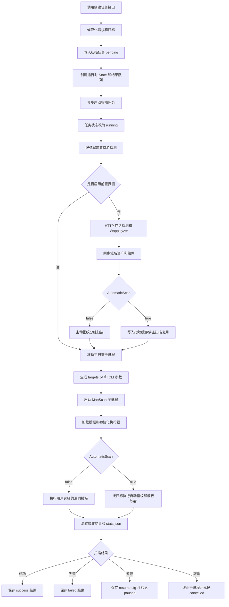

# 创建扫描任务后的整体调度流程

本文描述 ManScan 从创建扫描任务开始，到前置探测、模板加载、漏洞扫描、进度统计和任务收尾的完整调度过程。

## 一、总体流程

创建任务后的主流程如下：



主要代码入口：

- 创建和异步启动任务：`server/internal/service/scan_task_service.go`
- 服务端前置域名探测和主动指纹：`server/internal/service/scan_task_asset_domain.go`
- ManScan 主扫描入口：`internal/runner/runner.go`
- 模板调度和目标执行：`pkg/core/`
- 主机失败缓存：`pkg/protocols/common/hosterrorscache/`

## 二、创建任务阶段

### 2.1 请求规范化

创建任务接口首先执行 `normalizeCreateTaskRequest`：

1. 合并 `targets` 和 `inline_targets_list`。
2. 清理空行、首尾空白和重复目标。
3. 去除 URL 末尾多余的 `/`。
4. 没有目标时直接拒绝创建。
5. 没有任务名称时生成 `scan-YYYYMMDD-HHMMSS`。
6. 没有创建人时使用 `anonymous`。
7. 校验 Interactsh 服务地址和 Token。
8. 将部分扫描参数补充为默认值。

当前常用默认值如下：

| 参数 | 默认值 | 作用 |
| --- | ---: | --- |
| `rate_limit` | `150` | 全局请求速率 |
| `rate_limit_duration` | `1000 ms` | 速率窗口 |
| `bulk_size` | `25` | 目标并发规模 |
| `template_threads` | `25` | 普通模板并发规模 |
| `headless_bulk_size` | `10` | Headless 目标并发规模 |
| `headless_template_threads` | `10` | Headless 模板并发规模 |
| `js_concurrency` | `120` | JavaScript 并发规模 |
| `payload_concurrency` | `25` | Payload 并发规模 |
| `probe_concurrency` | `50` | 前置探测并发规模 |
| `timeout` | `10 s` | 请求超时时间 |
| `retries` | `1` | 请求重试次数 |
| `max_host_error` | `30` | 主机失败阈值 |
| `max_redirects` | `10` | 最大重定向次数 |
| `page_timeout` | `20 s` | Headless 页面超时 |
| `scan_strategy` | `auto` | 扫描策略，当前会转为 template-spray |

创建成功后：

1. 数据库中写入状态为 `pending` 的扫描任务。
2. 创建运行时目录和 `scanruntime.State`。
3. 创建漏洞结果队列和域名组件结果队列。
4. 写入 `task_created` 事件。
5. 异步启动任务，不阻塞创建接口等待扫描完成。

因此，创建接口返回的是任务摘要，真正的扫描调度在后台执行。

## 三、任务状态调度

### 3.1 状态流转

```text
pending
  |
  v
running
  |--------> success
  |--------> failed
  |--------> paused ---- resume ----> running
  |
  `--------> cancelled
```

具体行为：

- `pending`：任务已写入数据库，等待后台协程开始执行。
- `running`：任务已进入 `runTask`，开始准备和执行扫描。
- `success`：主扫描子进程正常结束，结果已保存。
- `failed`：出现未被处理的执行错误，或主扫描子进程异常退出。
- `paused`：收到暂停请求，保存断点后安全退出。
- `cancelled`：收到取消请求，终止当前扫描并清理运行资源。

### 3.2 暂停和恢复

暂停并不是立即粗暴杀死扫描进程，而是：

1. 设置运行时的暂停标志。
2. 尝试中断或终止扫描子进程。
3. 保存 `resume.cfg`。
4. 将任务标记为 `paused`。

恢复时：

1. 重新读取任务配置。
2. 创建新的运行时状态。
3. 保留已有结果摘要。
4. 调用仓储层准备恢复。
5. 重新启动扫描子进程并加载断点配置。

当前恢复逻辑会保留未完成模板和未完成目标，避免暂停时把正在执行的目标误记为已完成。

## 四、服务端前置域名探测

### 4.1 前置探测的启用条件

服务端前置探测由 `syncAliveAssetDomainsBeforeScan` 负责，只有满足以下条件才执行：

- 配置了域名资产仓储。
- 任务目标不为空。
- `offline_http=false`。
- `disable_http_probe=false`。

以下情况会跳过服务端前置探测：

- `OfflineHTTP=true`。
- `DisableHTTPProbe=true`。
- 当前服务未配置域名资产仓储。
- 没有扫描目标。

前置探测跳过后，主扫描仍然会继续。

### 4.2 HTTP 探测目标转换

服务端会将输入目标转换为可探测的 URL：

- 已有 `http://` 或 `https://` 的目标，直接探测。
- 没有协议的目标，根据系统的 scheme 顺序生成候选 URL。
- IPv6 目标会转换为带方括号的形式。
- 对每个目标依次尝试候选 URL，任意一个 HTTP 请求成功即视为 HTTP 存活。

前置探测使用：

- `probe_concurrency` 控制并发。
- `timeout` 控制请求超时。
- `retries` 控制重试。
- 任务代理配置会传递给探测客户端。

探测期间会增加实际完成请求数，但不会在一开始把探测请求加入漏洞扫描模板的预计总请求数。

### 4.3 Wappalyzer 被动指纹

HTTP 请求成功后，服务端会：

1. 保存 HTTP 状态码、标题、请求和响应摘要。
2. 使用 Wappalyzer 对响应头和响应体进行组件识别。
3. 将组件结果写入域名资产服务组件表。
4. 将组件结果写入扫描运行时结果事件。
5. 生成 `http_alive=true` 的指纹缓存记录。

HTTP 探测失败时：

1. 不生成 HTTP 存活观察结果。
2. 生成 `http_alive=false` 的缓存记录。
3. 保留该目标作为后续非 HTTP 主动指纹目标。

前置探测失败、资产配置读取失败或资产同步失败属于尽力而为流程。除上下文被取消外，这些错误通常会记录告警并继续主扫描。

## 五、非自动扫描流程：`AutomaticScan=false`

非自动扫描的目标是执行用户选择的漏洞模板，同时在服务端前置探测成功时补充域名组件主动指纹。

### 5.1 主动指纹目标分组

前置 HTTP 探测完成后，目标被分为两组：

| 目标组 | 判断条件 | 主动指纹模板 |
| --- | --- | --- |
| HTTP 存活组 | 至少一个 HTTP/HTTPS 探测请求成功 | 执行全部 `tech,detect,favicon` 模板 |
| HTTP 不存活组 | 所有候选 HTTP/HTTPS 探测请求失败 | 执行 `tech,detect,favicon`，但排除 `http,headless` 协议 |

HTTP 不存活组不会被整体丢弃。它仍然会执行 TCP、Network、MySQL 等非 HTTP 协议的指纹模板。

主动指纹子进程的关键参数：

```text
--tags tech,detect,favicon
```

对于 HTTP 不存活目标追加：

```text
-ept http,headless
```

这样可以避免向已确认 HTTP 不存活的目标继续发送无效 HTTP 或 Headless 请求。

### 5.2 主扫描模板过滤

当服务端已经执行前置主动指纹时，主扫描子进程会追加：

```text
-etags tech,detect,favicon
```

这样可以避免主扫描再次执行同一批域名指纹模板。

主扫描仍然会执行用户选择的漏洞模板。指纹结果通过资产组件队列和缓存参与后续资产同步或自动模板映射。

### 5.3 非自动扫描的请求总量

非自动扫描的请求总量由多个来源组成：

```text
总请求量 =
    主漏洞扫描子进程的模板请求总量
  + HTTP 存活目标的完整主动指纹请求总量
  + HTTP 不存活目标的非 HTTP 主动指纹请求总量
  + 其他已上报的外部扫描请求量
```

HTTP 存活组和 HTTP 不存活组分别启动主动指纹子进程，各自通过 `stats-json` 上报模板总量和实际请求数，服务端再进行累计。

因此，HTTP 不存活目标不会按照完整 HTTP 指纹模板数量重复计算。

## 六、自动扫描流程：`AutomaticScan=true`

自动扫描由 `pkg/protocols/common/automaticscan` 执行，目标是先识别组件，再根据组件标签选择漏洞模板。

### 6.1 服务端与自动扫描的衔接

当服务端前置探测成功时，会将结果写入任务目录：

```text
data/runtime/<task-id>/asset-domain-fingerprints.json
```

主扫描子进程通过环境变量读取：

```text
MANSCAN_ASSET_DOMAIN_FINGERPRINT_CACHE=<cache-path>
```

缓存记录包含：

- 原始目标。
- 规范化域名。
- `http_alive`。
- Wappalyzer 组件列表。

旧缓存如果没有 `http_alive` 字段，仍保持兼容，并按“未知状态”处理。

### 6.2 单个目标的自动扫描流水线

自动扫描对每个目标执行以下步骤：

```text
目标
  |
  v
读取 Wappalyzer 缓存
  |
  +-- 命中缓存：复用组件标签，不再重复 Wappalyzer 请求
  |
  `-- 未命中缓存：执行 Wappalyzer HTTP 请求
  |
  v
执行 detection/fingerprint 模板
  |
  +-- http_alive=true 或未知：执行全部指纹模板
  |
  `-- http_alive=false：过滤 HTTP/headless 指纹模板
  |
  v
合并组件标签、指纹 matcher/extractor 标签
  |
  v
移除内部 detect 标签并去重
  |
  v
按最终标签加载漏洞模板
  |
  v
启动该目标的漏洞模板扫描
```

自动扫描采用目标级流水线：一个目标完成指纹映射后，可以立即启动该目标的漏洞模板扫描，其他目标继续进行指纹识别。

### 6.3 自动扫描请求总量

自动扫描最终总量包含：

```text
总请求量 =
    未命中 Wappalyzer 缓存的目标数
  + 每个目标实际保留的指纹模板请求量
  + 每个目标映射出的漏洞模板请求量
```

对于 `http_alive=false` 的目标，HTTP/headless 指纹模板不会进入估算，也不会执行。

自动扫描在全部目标映射结束后发布整体预计总量，避免某一个目标提前发布局部总量造成进度比例失真。

## 七、主扫描子进程初始化

服务端为每个任务创建以下运行文件：

```text
data/runtime/<task-id>/
  targets.txt
  events.jsonl
  match.log
  error.log
  progress.json
  asset-domain-fingerprints.json
  resume.cfg
```

主扫描子进程通过 `manscan` 可执行文件启动；如果任务目录下没有可执行文件，则回退到：

```text
go run ./cmd/nuclei
```

常见传递参数包括：

- 目标文件：`-l targets.txt`
- JSON 结果：`-j`
- 统计输出：`-stats-json -stats`
- 自动扫描：`-as`
- 非 HTTP 输入的 HTTP 探测开关：`-nh`
- 普通模板过滤：`-etags tech,detect,favicon`
- 失败主机阈值：`-mhe`
- 关闭失败主机跳过：`-nmhe`
- 普通模板并发：`-c`
- 目标并发：`-bs`
- Headless 并发：`-headc`、`-hbs`
- 速率限制：`-rl`、`-rld`

服务端同时读取：

- `stdout`：JSON 结果和命中事件。
- `stderr`：日志、错误和 `stats-json` 进度。

## 八、引擎内部模板加载和 HTTP 探测

主扫描子进程启动后，ManScan 内部按以下顺序执行：

1. 初始化执行器、输出、限速器、Interactsh 和协议状态。
2. 加载 `.nuclei-ignore`。
3. 初始化主机失败缓存。
4. 创建工作流加载器和模板 Store。
5. 加载模板或工作流。
6. 执行可选的模板预检和端口预扫描。
7. 预取认证密钥。
8. 判断是否需要将非 HTTP 输入转换为 HTTP 输入。
9. 执行普通扫描或自动扫描。

### 8.1 非 HTTP 输入的内部 HTTP 探测

如果同时满足以下条件，Runner 会调用 `httpx`：

- 没有关闭 HTTP 探测。
- 已加载模板中存在 HTTP 或 Headless 请求。
- 输入目标不是标准 `http://` 或 `https://` URL。

该阶段会：

1. 对非 URL 输入执行 HTTP 探测。
2. 将探测成功的 URL 放入临时输入缓存。
3. 将 HTTP 形式的输入提供给 HTTP 模板。
4. 没有探测到 URL 的目标不会被转换为 HTTP 输入。

这个阶段与服务端域名资产前置探测是两条不同链路：

- 服务端前置探测用于域名资产存活、Wappalyzer、资产同步和主动指纹。
- Runner 内部 `httpx` 探测用于让 HTTP 模板能够处理非 URL 输入。

## 九、主机失败后跳过机制

### 9.1 配置项

| 配置项 | 默认值 | 含义 |
| --- | ---: | --- |
| `max_host_error` | `30` | 同一主机连续达到该失败次数后，跳过后续请求 |
| `no_host_errors` | `false` | 设置为 `true` 时关闭主机失败跳过 |
| `track_error` | 空 | 引擎侧额外指定需要计入主机失败的错误文本；当前创建任务 DTO 未单独暴露该字段 |

主机失败缓存只在以下条件成立时初始化：

```text
max_host_error > 0 && no_host_errors == false
```

### 9.2 有效阈值的特殊调整

Runner 初始化时，如果：

```text
template_threads > max_host_error
```

会将有效失败阈值调整为 `template_threads`，并输出调整日志。

因此，用户配置的 `max_host_error` 不一定是最终生效值。例如：

```text
max_host_error = 5
template_threads = 25
有效阈值 = 25
```

这样做是为了避免模板并发规模大于主机失败阈值时，主机刚开始出现并发失败就过早被跳过。

### 9.3 失败计数的主键

缓存会将目标归一化为主机地址，通常是：

```text
hostname:port
```

示例：

```text
https://example.com      -> example.com:443
http://example.com       -> example.com:80
example.com:8443         -> example.com:8443
```

因此，同一主机同一端口的不同 URL 路径通常共享失败计数。

### 9.4 哪些失败会计数

当前主机失败缓存的自动判断主要针对 HTTP 协议：

- 网络临时错误，例如连接超时、读取超时、连接重置等。
- 网络永久错误，例如连接拒绝、无法解析或无法建立连接等。
- `track_error` 中配置的错误文本。
- 代码中特别识别的网络错误字符串。

以下情况不会作为主机失败累计：

- 模板逻辑错误。
- 调用方上下文已经取消或超时导致的错误。
- 某些 Raw HTTP 因发送异常数据导致的预期连接关闭。
- 未被识别为网络错误、且未命中 `track_error` 的普通错误。

需要特别注意：

```text
hosterrorscache.checkError() 当前只对 HTTP 协议自动计数。
```

因此，TCP、Network、DNS、MySQL 等非 HTTP 模板自身发生的错误，默认不会通过这个缓存累计为“主机失败”。但是缓存的跳过检查使用归一化后的主机地址；如果同一进程中 HTTP 阶段已经将该地址标记为不可用，后续协议在检查缓存时也可能跳过该地址。

### 9.5 连续失败和成功重置

失败计数是连续失败计数，不是任务生命周期内的永久累计：

```text
失败 1 -> 失败 2 -> 成功 -> 失败 1
```

一次成功会移除该主机的失败缓存，重新开始计数。

任务上下文被取消或达到任务整体超时时，产生的错误不会继续累计到主机失败缓存。

### 9.6 何时检查和跳过

主机失败缓存会在多个层级检查：

#### 模板喷洒模式

对每个模板遍历目标时，在把目标加入执行队列前检查：

```text
目标已达到失败阈值
  -> 不再调度该目标的当前模板请求
  -> 生成 host skipped 结果事件
  -> 继续处理其他目标
```

#### 主机喷洒模式

对单个目标依次调度模板时，在启动下一个模板前检查：

```text
目标已达到失败阈值
  -> 生成 host skipped 结果事件
  -> 结束该目标后续模板调度
```

#### HTTP 模板内部

HTTP 模板在生成请求、提交请求和处理请求结果的多个节点检查主机状态。达到阈值后：

- 停止继续生成该目标的后续 HTTP 请求。
- 取消当前模板剩余请求。
- 已经在途的请求不会被强制撤销，只会在后续检查点停止继续扩展。

#### Network 模板内部

Network 模板也会检查不响应地址，避免在同一个模板中继续对已知不可用地址进行无意义的端口或请求操作。

### 9.7 主机跳过事件

跳过目标时会生成结果事件，错误信息类似：

```text
host was skipped as it was found unresponsive
```

这类事件表示调度器主动跳过了请求，不代表模板检测命中漏洞。

## 十、并发和限速关系

扫描中存在多层并发控制：

| 层级 | 配置 | 作用 |
| --- | --- | --- |
| 前置探测 | `probe_concurrency` | HTTP/Wappalyzer 探测并发 |
| 目标批次 | `bulk_size` | 同时处理的目标批次 |
| 普通模板 | `template_threads` | 普通模板执行并发 |
| Headless 模板 | `headless_template_threads` | Headless 模板执行并发 |
| Headless 目标 | `headless_bulk_size` | Headless 目标批次 |
| JavaScript | `js_concurrency` | JavaScript 执行并发 |
| Payload | `payload_concurrency` | Payload 生成并发 |
| 全局请求 | `rate_limit` + `rate_limit_duration` | 全局发送速率 |

`scan_strategy=auto` 当前会在引擎中转换为 `template-spray`。这意味着通常按“模板 -> 目标”组织调度；但自动扫描本身会在目标完成映射后立即启动该目标的漏洞模板，属于目标级流水线。

并发意味着主机失败阈值是“达到阈值后，后续调度检查生效”，不是严格意义上的全局请求硬截断。达到阈值前已经进入执行队列或已经发出的请求仍可能完成。

## 十一、进度和请求统计

运行时维护两类请求数：

| 字段 | 含义 |
| --- | --- |
| `requests` | 逻辑上已完成或跳过的请求/模板执行进度 |
| `actual_requests` / `real_requests` | 实际发出的网络请求数 |
| `total_requests` | 当前已知或估算的总请求数 |

### 11.1 前置探测统计

服务端前置 HTTP/Wappalyzer 探测会增加已完成和实际请求数，但不会直接把这些请求作为主漏洞模板总量发布。

主动指纹子进程会通过 `stats-json` 上报：

- 逻辑请求数。
- 实际请求数。
- 模板请求总量。
- 总量是否已经确定。

服务端会将两个主动指纹子进程的统计合并。

### 11.2 非自动扫描统计

非自动扫描最终将以下统计合并：

```text
前置主动指纹统计
  + 主漏洞扫描子进程统计
  + 其他外部请求统计
```

主扫描子进程的 `total` 会加上服务端已经记录的外部请求总量，避免前置探测和主动指纹请求从最终统计中丢失。

### 11.3 自动扫描统计

自动扫描在所有目标完成指纹映射后统一发布预计总量：

```text
Wappalyzer 请求
  + 未被过滤的指纹模板请求
  + 自动映射出的漏洞模板请求
```

如果某目标的 `http_alive=false`，其 HTTP/headless 指纹模板请求不会进入总量。

在总量尚未确定时，进度状态为 `calculating`；总量发布后切换为 `running`，避免在自动映射阶段误显示为完成。

## 十二、结果处理和任务收尾

主扫描子进程输出结果后，服务端会：

1. 解析漏洞结果和指纹结果。
2. 将漏洞结果放入漏洞队列。
3. 将域名组件结果放入资产组件队列。
4. 更新去重后的风险统计、组件统计和命中数量。
5. 解析 `stats-json` 更新进度。
6. 将日志写入 `events.jsonl` 并推送订阅者。

正常结束时：

1. 关闭漏洞队列和资产组件队列。
2. 归档响应文件。
3. 写入扫描结果摘要。
4. 更新任务状态为 `success`。
5. 写入完成事件。
6. 清理 resume 文件和运行时资源。

失败、取消和暂停会走不同的收尾路径，但都会尽量保存当前摘要和运行日志。

## 十三、典型场景说明

### 场景 A：HTTP 服务存活，非自动扫描

```text
HTTP 探测成功
  -> Wappalyzer
  -> 完整主动指纹：HTTP + Headless + TCP/Network 等
  -> 主扫描过滤 tech/detect/favicon
  -> 执行用户选择的漏洞模板
```

### 场景 B：HTTP 不存活，但目标可能是 MySQL/TCP

```text
HTTP 探测失败
  -> 写入 http_alive=false
  -> 跳过 Wappalyzer 组件识别
  -> 主动指纹只执行非 HTTP 模板
  -> 保留 TCP/Network/MySQL 等识别机会
  -> 主扫描继续执行漏洞模板
```

### 场景 C：HTTP 不存活，自动扫描

```text
HTTP 探测失败
  -> 自动扫描读取 http_alive=false
  -> 不重复发起 Wappalyzer 请求
  -> detection 阶段过滤 HTTP/headless 模板
  -> 保留非 HTTP 指纹模板
  -> 根据最终非 HTTP 标签映射漏洞模板
```

### 场景 D：HTTP 主机连续失败达到阈值

```text
HTTP 请求失败
  -> 记录 host:port 失败次数
  -> 达到有效 MaxHostError
  -> 后续模板/请求调度前检查到已不可用
  -> 生成 host skipped 事件
  -> 避免继续对该主机发送无意义请求
```

### 场景 E：失败后恢复

```text
失败 1
  -> 失败 2
  -> 成功
  -> 清除失败缓存
  -> 后续失败从 1 重新计数
```

## 十四、配置建议和边界

### 14.1 希望启用主机失败跳过

建议保持：

```json
{
  "max_host_error": 30,
  "no_host_errors": false
}
```

### 14.2 希望完全关闭主机失败跳过

通过创建任务接口可以使用：

```json
{
  "no_host_errors": true
}
```

在服务端创建任务接口中，不建议通过 `max_host_error=0` 关闭，因为服务端的默认值归一化会将小于等于 `0` 的值转换为 `30`。关闭后，连接失败目标仍会继续尝试后续模板和请求，可能显著增加扫描耗时和失败请求量。

如果直接使用 ManScan 引擎 CLI/SDK，则 `max_host_error=0` 可以使 `ShouldUseHostError()` 返回关闭状态；服务端任务接口仍应优先使用 `no_host_errors=true`。

### 14.3 自定义额外失败文本

如果某些环境返回的错误没有被内置规则识别，可以配置：

```json
{
  "track_error": [
    "custom connection failure"
  ]
}
```

`track_error` 主要用于补充 HTTP 错误分类，不会把所有协议的任意业务响应自动视为主机失败。

### 14.4 HTTP 探测和主机失败阈值不是同一机制

需要区分：

- 前置 HTTP/Wappalyzer 探测失败：用于判断 HTTP 是否存活，并决定是否过滤 HTTP 指纹模板。
- 主机失败缓存：用于主扫描过程中根据连续网络失败跳过后续请求。

前置 HTTP 探测失败不会直接把目标写入主扫描进程的 `HostErrorsCache`。它通过 `http_alive=false` 缓存影响自动扫描和主动指纹模板选择。

非自动扫描的两个主动指纹子进程与主漏洞扫描子进程也是相互独立的进程，各自初始化自己的主机失败缓存；前置 HTTP 探测阶段的失败计数不会跨进程带入后续扫描。

